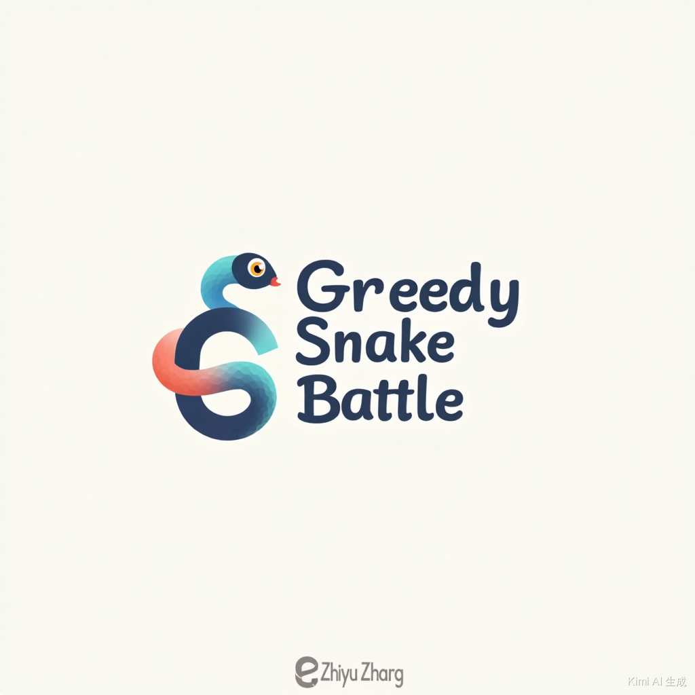
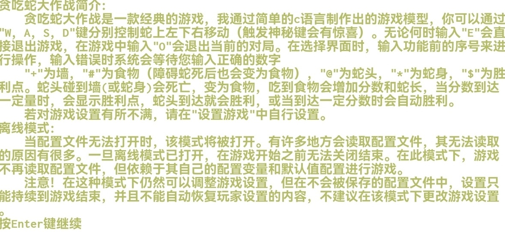
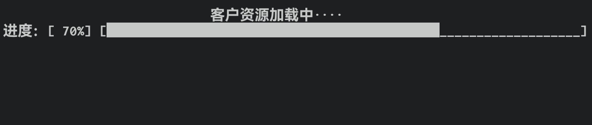

# Greedy Snake Battle



## Table of Contents

- [Project Overview](#project-overview)
- [Project License](#project-license)
- [Signature Verification](#signature-verification)
- [Game Features](#game-features)
- [Game Controls](#game-controls)
- [Game Elements](#game-elements)
- [Game Flow](#game-flow)
- [Offline Mode](#offline-mode)
- [Game Interface](#game-interface)
- [Build & Installation](#build--installation)
- [Cross-Platform Support](#cross-platform-support)
- [Known Issues](#known-issues)
- [Future Plans](#future-plans)
- [Code Style Summary & Contribution Guidelines](#code-style-summary--contribution-guidelines)

---
## Project Overview

This is a cross-platform snake battle game implemented in C, featuring rich configuration options and complete game functionality. The project adopts a modular design and supports multiple operating systems.  

Author: Zhang Zhiyu  
License: MIT License: [LICENSE.txt](./LICENSE.txt)  
Contributions, suggestions, and issues are welcome.

## Project License

### MIT License

**MIT License**.

### Authorization Scope

- **Free Authorization**: Anyone who obtains a copy of this software and its associated documentation files ("Software") can use it for free.

- **Usage Rights**: Licensees are free to handle the software, including but not limited to using, copying, modifying, merging, publishing, distributing, sublicensing, and selling copies of the software.

### Conditions

- **Retain Copyright and License Notices**: All copies or significant portions of the software must include the above copyright and license notices.

### Disclaimer

- **No Warranty**: The software is provided "as is," without any warranty, express or implied, including but not limited to warranties of merchantability, fitness for a particular purpose, and non-infringement.

- **No Liability**: Under no circumstances shall the authors or copyright holders be liable for any claims, damages, or other liabilities arising from the software or its use.

### View License

MIT License: [LICENSE.txt](./LICENSE.txt)

---
## Signature Verification

### Prerequisites

Required: GPG: GPG Official Website: [https://gnupg.org](https://gnupg.org)  
Windows Version (GPG4Win): [https://gpg4win.org](https://gpg4win.org)  

#### **Install GPG**

##### **Windows**
1. Download and install [GPG4Win](https://gpg4win.org/download.html).
2. Ensure **"GPG (GnuPG) Command Line"** is selected during installation to make `gpg.exe` available.

##### **Linux/macOS**

- Linux
    ```bash
    sudo (package manager) install gnupg
    ```
    Replace `(package manager)` with your system's package manager (e.g., `apt` for Ubuntu/Debian).
- macOS
    ```shell
    brew install gnupg
    ```

### 1. Import Public Key (located in the project root directory):

```bash
gpg --import ./signatures/PublicKey/GreedySnakeBattle_PublicKey.asc
```

### 2. Verify Signatures:

- Single File Verification (using README.md as an example)
    ```bash
    gpg --verify signatures/README.md.asc README.md
    ```
- Batch Verification
    - Source Files (Unix-Like)
        ```bash
        find source/ -type f \( -name "*.c" -o -name "*.h" \) -exec sh -c 'gpg --verify signatures/$(basename {}).asc {}' \;
        ```
    - README.md Verification
        ```bash
        gpg --verify signatures/README.md.asc README.md
        ```
    - LICENSE.txt Verification
        ```bash
        gpg --verify signatures/LICENSE.txt.asc LICENSE.txt
        ```
- Expected Output
    1. `Good signature from "Zhang Zhiyu (A C And Cpp Development Designer) <2585689367@qq.com>` indicates the file and signature are untampered.
        ```txt
        gpg: Signature made 20XX-XX-XX XX:XX:XX +0800 CST
        gpg:                using RSA key CAD77FD957132D24B9B75D1AFFAB5EB03E8460D0
        gpg: Good signature from "Zhang Zhiyu (A C And Cpp Development Designer) <2585689367@qq.com>" [ultimate]
        ```
    
    2. `BAD signature from "Zhang Zhiyu (A C And Cpp Development Designer) <2585689367@qq.com>` indicates **the file or signature has been tampered with**.  
        **It is not recommended to use these files as they may pose unknown risks!**
        ```txt
        gpg: Signature made 20XX-XX-XX XX:XX:XX +0800 CST
        gpg:                using RSA key CAD77FD957132D24B9B75D1AFFAB5EB03E8460D0
        gpg: BAD signature from "Zhang Zhiyu (A C And Cpp Development Designer) <2585689367@qq.com>" [ultimate]
        ```

---
### Automated Verification Scripts

#### Windows

Save the following script as `verify_all.ps1` in the project root directory and run it:
```powershell
# Import public key (if not already imported)
$publicKey = ".\signatures\PublicKey\GreedySnakeBattle_PublicKey.asc"
gpg --import $publicKey

# Verify source files
Get-ChildItem -Path .\source -Recurse -Include *.c, *.h | ForEach-Object {
    $sigFile = ".\signatures\" + $_.Name + ".asc"
    if (Test-Path $sigFile) {
        Write-Host "Verifying file: $($_.FullName)"
        gpg --verify $sigFile $_.FullName
        
        # Error check
        if ($LASTEXITCODE -ne 0) {
            Write-Host "Error: $($_.FullName) verification failed!" -ForegroundColor Red
            exit 1
        }
    }
}

# Verify README.md and LICENSE.txt
gpg --verify .\signatures\README.md.asc .\README.md
gpg --verify .\signatures\LICENSE.txt.asc .\LICENSE.txt

Write-Host "Verification complete! Check for 'BAD signature' outputs." -ForegroundColor Green
```

Run PowerShell as administrator and execute:
```powershell
Set-ExecutionPolicy RemoteSigned -Scope Process  # Allow script execution
```
```powershell
.\verify_all.ps1
```

#### Linux/macOS

##### **1. Script Content**  

Save the following code as `verify_signatures.sh` in the project root directory:  
```bash
#!/bin/bash

# ------------------------------------------
# GreedySnakeBattle Signature Verification Script (Linux/macOS)
# Function: Automatically verify GPG signatures for all .c/.h/README.md/LICENSE.txt files
# Usage: ./verify_signatures.sh
# ------------------------------------------

# Check if GPG is installed
if ! command -v gpg &> /dev/null; then
    echo "❌ Error: GPG is not installed! Please install it first:"
    echo "  - Debian/Ubuntu: sudo apt install gnupg"
    echo "  - macOS: brew install gnupg"
    exit 1
fi

# Define signature directory and public key path
SIGNATURES_DIR="./signatures"
PUBLIC_KEY="$SIGNATURES_DIR/PublicKey/GreedySnakeBattle_PublicKey.asc"

# Check if the signature directory exists
if [ ! -d "$SIGNATURES_DIR" ]; then
    echo "❌ Error: Signature directory $SIGNATURES_DIR does not exist!"
    exit 1
fi

# Check if the public key exists
if [ ! -f "$PUBLIC_KEY" ]; then
    echo "❌ Error: Public key file $PUBLIC_KEY not found!"
    exit 1
fi

# Import public key
echo "🔑 Importing public key..."
gpg --import "$PUBLIC_KEY" 2> /dev/null
if [ $? -ne 0 ]; then
    echo "❌ Error: Public key import failed!"
    exit 1
fi

# Verify all source files (.c and .h)
echo "🔍 Verifying source files..."
FAILED=0
for file in $(find ./source -type f \( -name "*.c" -o -name "*.h" \)); do
    sig_file="$SIGNATURES_DIR/$(basename $file).asc"
    if [ -f "$sig_file" ]; then
        echo "📄 Verifying: $file"
        gpg --verify "$sig_file" "$file" 2> /dev/null
        if [ $? -ne 0 ]; then
            echo "❌ Verification failed: $file"
            FAILED=1
        fi
    else
        echo "⚠️ Warning: Signature file not found: $sig_file"
    fi
done

# Verify README.md and LICENSE.txt
echo "📜 Verifying document files..."
for file in "README.md" "LICENSE.txt"; do
    sig_file="$SIGNATURES_DIR/$file.asc"
    if [ -f "$sig_file" ]; then
        echo "📄 Verifying: $file"
        gpg --verify "$sig_file" "$file" 2> /dev/null
        if [ $? -ne 0 ]; then
            echo "❌ Verification failed: $file"
            FAILED=1
        fi
    else
        echo "⚠️ Warning: Signature file not found: $sig_file"
    fi
done

# Final result
if [ $FAILED -eq 0 ]; then
    echo "✅ All files verified successfully!"
else
    echo "❌ Some files failed verification. Please check the logs!"
    exit 1
fi
```

##### **2. Usage**

1. **Grant execution permissions**:  
   ```bash
   chmod +x verify_signatures.sh
   ```

2. **Run the script**:  
   ```bash
   ./verify_signatures.sh
   ```

3. **Expected Output**:  
   - If all files pass verification:  
     ```txt
     ✅ All files verified successfully!
     ```
   - If some files fail verification:  
     ```txt
     ❌ Verification failed: ./source/main.c
     ❌ Some files failed verification. Please check the logs!
     ```

##### **3. Script Features**

✅ **Cross-platform compatibility**: Supports **Linux** and **macOS** (requires `gnupg`).  
✅ **Automatic dependency check**: Prompts the user to install GPG if not found.  
✅ **Batch verification**: Automatically scans all `.c` and `.h` files in `./source/`.  
✅ **Error handling**:  
   - Warns if a signature file is missing (`⚠️`).  
   - Marks failures (`❌`) and exits if signatures do not match.  

---
## Game Features

- Classic snake game mechanics
- Customizable game settings
- Cross-platform support (Windows/Linux/macOS/Termux)
- Blocking and non-blocking operation modes
- Comprehensive API interface
- Detailed documentation

## Game Controls

  
| Key | Function |
| :--: | :--: |
| W | Move Up |
| A | Move Left |
| S | Move Down |
| D | Move Right |
| E | Exit Game Immediately |
| O | Exit Current Match |

## Game Elements


| Symbol | Element |
|------|----------|
| @ | Snake Head |
| * | Snake Body |
| # | Food |
| + | Wall |
| $ | Victory Point |

## Game Flow

- 1. **Client Resource Loading** (Can be retained if modifying and recompiling the source code)  
     
- 2. **First-Time Login Screen** (Only displayed on the first run; can be retained if modifying and recompiling the source code)  
     

- 3. **Main Menu**

   

   | Option | Function |
   | :--: | :--: |
   | 1 | Start Game |
   | 2 | Game Instructions |
   | 3 | Game Settings |
   | 4 | Exit Game |

- 4. **Game Settings**

   

   Configurable options include:
   - Whether the game ends if the snake bites itself
   - Snake movement speed
   - Points required for victory
   - Number of food items
   - Number of walls
   - Whether to enable system-controlled snakes
   - Game screen size
   - Game background color
   - Restore all default settings, etc.

- 5. **Gameplay Screen**

   

- 6. **Game Over** (Victory or Defeat)

---
## Offline Mode

When the configuration file cannot be opened, the game automatically enters offline mode:

- **Features**:
    - Does not read the configuration file
    - Uses built-in default settings
    - Changes to settings are not saved
    - Settings revert to defaults after the game ends

- **Notes**:
    - Settings can be adjusted in offline mode but will not be saved
    - It is not recommended to modify settings in offline mode
    - Once enabled, offline mode cannot be disabled until the game ends

---
## Game Interface

> Skip this section if you are not a *developer* or do not need to review the game interface.

The game provides a standardized external interface function `GreedySnakeBattleGameExternalInterface`, defined in [GreedySnakeBattleGameExternalInterface.h](./source/Include/GreedySnakeBattleGameExternalInterface.h).

### Linking Options

| Type | Library Name | Linking Command |
| :--: | :----: | :------: |
| Static Library | libgsnakebg.a | `gcc ... -lgsnakebg` |
| Dynamic Library | libgsnakebg.so | `gcc ... -lgsnakebg` |

### Function Prototype

```c
#include <GreedySnakeBattleGameExternalInterface.h>

    int GreedySnakeBattleGameExternalInterface(int isBlockRunning);
```

### Parameters

`isBlockRunning`: Whether the game blocks the calling process.  
    | Macro (Global Constant) | Behavior |
    | :----: | :-----: |
    | SNAKE_BLOCK | Blocking operation |
    | SNAKE_UNBLOCK | Non-blocking operation |

### Return Values

| Return Value | Description |
| :----: | :--: |
| -2 | Invalid parameter |
| -1 | System call failed |
| 0 | Game ended (blocking mode) |
| 1 | Game started successfully (non-blocking mode) |

### Example

```c
#include "GreedySnakeBattleGameExternalInterface.h"

int main() {
    int ret = GreedySnakeBattleGameExternalInterface(SNAKE_BLOCK);
    
    switch (ret) {
        case -2:
            printf("Invalid parameter!\n");
            break;
        case -1:
            printf("Failed to start the game!\n");
            break;
        case 0:
            printf("Game over.\n");
            break;
        case 1:
            printf("Game running in the background.\n");
            break;
    }
    
    return 0;
}
```

### Code Standards

| Item | Standard |
| :--: | :--: |
| Programming Language | C Language - C99 (ISO/IEC 9899:1999) |
| Unix-like Systems | POSIX.1-2008 |
| Windows Systems | Win32 API |

---
## Build & Installation

### Build Requirements

- CMake 3.10+
- C Compiler (GCC/Clang/MSVC)
- Doxygen (for documentation generation) (optional)

### Build Steps

- 1. Create and enter the build directory (to keep the root directory clean)
```bash
mkdir build # Create build directory
```
```bash
cd build    # Enter build directory
```

- 2. Run CMake
```bash
cmake ..    # Run CMake
```

- 3. Run Make
    - 1. Compile source files  
         ```bash
         make                        # Compile source files
         ```
         Generates the GreedySnakeBattle(.exe) executable, libgsnakebg.so dynamic library, and libgsnakebg.a static library.
    
    - 2. Generate API documentation
         - 1. With Doxygen installed
              ```bash
              make API_documents     # Generate API documentation
              ```
         - 2. Without Doxygen
              ```bash
              mv ../pre_generated_API_documents ../API_documents # Rename ../pre_generated_API_documents to ../API_documents
              ```

    - 3. Install
         ```bash
         sudo make install           # Install (requires admin rights) (Termux does not require admin rights)
         ```

### Installation Contents

1. **Executable**: `GreedySnakeBattle` (`GreedySnakeBattle.exe` on Windows)
2. **Libraries**:
   - Static Library: `libgsnakebg.a`
   - Dynamic Library: `libgsnakebg.so` (`libgsnakebg.dll` on Windows)
3. **Header Files**: All header files in the `Include/` directory
4. **API Documentation**: HTML-formatted API documentation

---
## Cross-Platform Support

The game supports the following platforms:

1. **Windows**:
    - Automatically creates a desktop shortcut
    - Sets the application icon
    - Uses Win32 API for terminal control

2. **Linux**:
    - Standard Unix installation paths
    - Creates a .desktop desktop shortcut
    - Uses termios for terminal control

3. **Termux (Android)**:
    - Special installation path adaptation
    - Optimized for mobile terminals

4. **macOS**:
    - Standard Unix installation paths
    - Uses termios for terminal control

---
## Known Issues

1. **Performance Issues**:
    - The game may lag when the snake grows very large.

2. **Functional Limitations**:
    - Obstacle snakes cannot automatically avoid user snakes and walls.
    - Logic for user snakes eating obstacle snake bodies is not precise.

For a detailed list of issues, see the BUGs section in [GreedySnakeBattleGameExternalInterface.c](./source/GreedySnakeBattleGameExternalInterface.c).

## Future Plans

1. **New Features**:
    - Add portals.
    - Infinite food mode.

2. **Improvements**:
    - Optimize obstacle snake AI.
    - Improve snake body rendering logic.

For detailed plans, see the TODOs section in [GreedySnakeBattleGameExternalInterface.c](./source/GreedySnakeBattleGameExternalInterface.c).

## Code Style Summary & Contribution Guidelines

Based on the project, the following **comment style**, **naming conventions**, and **code style** are summarized for contributors.  

### **1. Comment Style (Javadoc Style)**  
The code primarily uses **Doxygen/Javadoc-style comments** for API documentation generation.  

#### **Rules**:

✅ **File Comments** (at the beginning of the file):  
```c
/**
 * @file GreedySnakeBattleGameExternalInterface.c
 * @brief This file implements the @ref GreedySnakeBattleGameExternalInterface function.
 * @author Zhang Zhiyu
 */
```

✅ **Function Comments** (detailed description of function purpose, parameters, and return value):  
```c
/**
 * @brief Initialize terminal settings
 * @ingroup OSAdapt
 * 
 * Save the original terminal mode and enable ANSI escape code support.
 */
static void _windows_init_console() {
    // ...
}
```

✅ **Struct/Enum Comments**:  
```c
/**
 * @struct GameAllRunningData
 * @brief Stores all runtime data for the game.
 */
typedef struct {
    int score;  /**< Current score */
    // ...
} GameAllRunningData;
```

❌ **Avoid**:
- Single-line comments `//` should only be used for temporary debugging; use `/** */` or `/* */` in formal code.  
- Meaningless comments like `// This is a variable`.  

#### **Contributor Notes**:
- **New functions/files** must include complete Doxygen comments.  
- **Modify functions** by updating the corresponding `@brief` and `@param` descriptions.  
- **Critical logic** should include `@note` or `@attention` for special cases.  

---
### **2. Naming Conventions (Qt Style)**

Adopts a **Qt-like naming style** with minor adjustments:  

#### **Rules**:
| Type | Naming Style | Example |
| :--: | :------: | :--: |
| **Functions** | Snake case (`snake_case`) for OS-adaptation functions and special function groups; otherwise, lowerCamelCase | `init_terminal_settings()`, `setConfig_isEnableObs`, `foodInit` |
| **Variables** | `lowerCamelCase` | `gameScore` |
| **Structs** | Struct name: `UpperCamelCase`; member variables: `lowerCamelCase` | `GameConfig`, `isEnableObs` |
| **Macros/Enums/Global Constants** | `UPPER_CASE` | `SNAKE_BLOCK`, `ENABLE_ECHO_INPUT` |
| **Global Variables** | `lowerCamelCase` | `isConfigFileOpenFail` |
| **Type Definitions** | `PascalCase` + `_t` (optional) | `GameAllRunningData`, `muint_t` |

#### **Contributor Notes**:
- **New variables/functions/...** should follow the above naming conventions.
- **Avoid** Hungarian notation (e.g., `bIsRunning`, `iCount`).  
- **Macros** must be in uppercase, e.g., `#define MAX_SNAKE_LENGTH 100`.  

---
### **3. Code Style (Qt Style)**  
The code style resembles **Qt/C++** but adapts to C language limitations.  

#### **Rules**:
✅ **Indentation**:
- **4-space indentation** (no tabs).  
- Function bodies and `if/for/while` blocks must be indented.  

✅ **Braces `{}`**:
- **K&R style** (opening brace on the same line):  
```c
if (condition) {
    // code
}
```

✅ **Spacing**:
- Spaces around operators:  
```c
int sum = a + b;
if (score > 100) { ... }
```
- Space after commas in function parameters:  
```c
void foo(int a, int b, int c);
```

✅ **Pointer `*` Placement**:  
```c
GameAllRunningData *data = malloc(sizeof(GameAllRunningData));
```

❌ **Avoid**:
- Multiple statements per line, e.g., `a=1; b=2;`.  
- Excessively long lines (recommended to wrap at 80~120 characters).  

#### **Contributor Notes**:
- **New code** must follow existing indentation and brace styles.  
- **Modify code** consistently; do not mix `if (x){` and `if (x) {`.  
- **Complex logic** should be split into smaller functions to avoid overly long functions.  

---
### **Summary: Rules for Contributors**  
| Item | Rule |
| :--: | :--: |
| **Comments** | Doxygen/Javadoc style; mandatory for functions, files, and critical variables |
| **Naming** | As above |
| **Code Style** | 4-space indentation, K&R braces, pointer `*` adjacent to variable name |

### **How to Check?**  
1. **Clang-Format** (configured via `.clang-format` file).  
2. **Doxygen** to generate documentation and check comment completeness.  
3. **Code review** for naming and style consistency.  

Contributors are encouraged to maintain code style uniformity for better maintainability! 🚀

# 贪吃蛇大作战


## 目录

- [项目概述](#项目概述)
- [项目许可证](#项目许可证)
- [签名验证](#签名验证)
- [游戏特点](#游戏特点)
- [游戏控制](#游戏控制)
- [游戏元素](#游戏元素)
- [游戏流程](#游戏流程)
- [离线模式](#离线模式)
- [游戏接口](#游戏接口)
- [构建与安装](#构建与安装)
- [跨平台支持](#跨平台支持)
- [已知问题](#已知问题)
- [未来计划](#未来计划)
- [代码风格总结与贡献指南](#代码风格总结与贡献指南)

---
## 项目概述

这是一个用C语言实现的跨平台贪吃蛇对战游戏，具有丰富的配置选项和完整的游戏功能。项目采用模块化设计，支持多种操作系统平台。  
  
作者: 张志宇  
许可证: MIT许可证: [LICENSE.txt](./LICENSE.txt)  
欢迎提交修改，建议和Issues。

## 项目许可证

### MIT许可证

**麻省理工学院许可证**（MIT License)。

### ​授权范围

- **​免费授权**​：任何人获得该软件及其相关文档文件（“软件”）的副本后，都可以免费使用。

- **​使用权限**​：被授权人可以不受限制地处理该软件，包括但不限于使用、复制、修改、合并、发布、分发、再授权以及销售软件副本。

### ​条件限制

- **​保留版权声明和许可声明**​：在软件的所有副本或重要部分中，必须包含上述版权声明和许可声明。

### ​免责声明

- **​无保证**​：该软件是“按原样”提供的，没有任何形式的保证，无论是明示还是暗示，包括但不限于对适销性、特定用途的适用性以及不侵权的保证。

- **​无责任**​：无论是在合同行为、侵权行为还是其他任何情况下，软件的作者或版权持有人都不对因软件或其使用而产生的任何索赔、损害或其他责任负责。​

### 查看许可证

MIT许可证：[LICENSE.txt](./LICENSE.txt)

---
## 签名验证

### 预备

需要：GPG：GPG官网：[https://gnupg.org](https://gnupg.org)  
Windows版本(GPG4Win) [https://gpg4win.org](https://gpg4win.org)  

#### **安装GPG**

##### **Windows**
1. 下载安装 [GPG4Win](https://gpg4win.org/download.html)。
2. 安装时勾选**"GPG (GnuPG) Command Line"** 以确保 `gpg.exe` 可用。

##### **Linux/macOS**

- Linux
    ```bash
    sudo (安装包管理器) install gnupg
    ```
    把`(安装包管理器)`替换为系统的安装包管理器(如，Ubuntu/Debian替换为apt)
- MacOS
    ```shell
    brew install gnupg
    ```

### 1.导入公钥(位于项目根目录下)：

```bash
gpg --import ./signatures/PublicKey/GreedySnakeBattle_PublicKey.asc
```

### 2.验证签名：

- 单个文件验证(以README.md文件为例)
    ```bash
    gpg --verify signatures/README.md.asc README.md
    ```
- 批量验证
    - 源文件验证(Unix-Like)
        ```bash
        find source/ -type f \( -name "*.c" -o -name "*.h" \) -exec sh -c 'gpg --verify signatures/$(basename {}).asc {}' \;
        ```
    - README.md文档验证
        ```bash
        gpg --verify signatures/README.md.asc README.md
        ```
    - LICENSE.txt许可证文档验证
        ```bash
        gpg --verify signatures/LICENSE.txt.asc LICENSE.txt
        ```
- 确认输出
    1. 包含`Good signature from "Zhang Zhiyu (A C And Cpp Development Designer) <2585689367@qq.com>`表示源文件和签名未被修改。
        ```txt
        gpg: Signature made 20XX-XX-XX XX:XX:XX +0800 CST
        gpg:                using RSA key CAD77FD957132D24B9B75D1AFFAB5EB03E8460D0
        gpg: Good signature from "Zhang Zhiyu (A C And Cpp Development Designer) <2585689367@qq.com>" [ultimate]
        ```
    
    2. 包含`BAD signature from "Zhang Zhiyu (A C And Cpp Development Designer) <2585689367@qq.com>`表示**源文件和签名被篡改**。  
        **此时不建议再使用这些文件，因为这些文件可能被篡改过，可能存在未知风险！！！**
        ```txt
        gpg: Signature made 20XX-XX-XX XX:XX:XX +0800 CST
        gpg:                using RSA key CAD77FD957132D24B9B75D1AFFAB5EB03E8460D0
        gpg: BAD signature from "Zhang Zhiyu (A C And Cpp Development Designer) <2585689367@qq.com>" [ultimate]
        ```

---
### 自动化检查脚本

#### Windows

将以下脚本保存为 `verify_all.ps1`，放在项目根目录运行：
```powershell
# 导入公钥（如果尚未导入）
$publicKey = ".\signatures\PublicKey\GreedySnakeBattle_PublicKey.asc"
gpg --import $publicKey

# 验证源码文件
Get-ChildItem -Path .\source -Recurse -Include *.c, *.h | ForEach-Object {
    $sigFile = ".\signatures\" + $_.Name + ".asc"
    if (Test-Path $sigFile) {
        Write-Host "验证文件: $($_.FullName)"
        gpg --verify $sigFile $_.FullName
        
        # 错误检查
        if ($LASTEXITCODE -ne 0) {
            Write-Host "错误: $($_.FullName) 验证失败！" -ForegroundColor Red
            exit 1
        }
    }
}

# 验证 README.md 和 LICENSE.txt
gpg --verify .\signatures\README.md.asc .\README.md
gpg --verify .\signatures\LICENSE.txt.asc .\LICENSE.txt

Write-Host "验证完成！检查是否有 'BAD signature' 输出。" -ForegroundColor Green
```

以管理员身份运行PowerShell，然后执行：
```powershell
Set-ExecutionPolicy RemoteSigned -Scope Process  # 允许运行脚本
```
```powershell
.\verify_all.ps1
```

#### Linux/macOS

##### **1. 脚本内容**  

将以下代码保存为 `verify_signatures.sh`，并放在项目根目录：  
```bash
#!/bin/bash

# ------------------------------------------
# GreedySnakeBattle 签名验证脚本 (Linux/macOS)
# 功能：自动验证所有 .c/.h/README.md/LICENSE.txt 的 GPG 签名
# 用法：./verify_signatures.sh
# ------------------------------------------

# 检查是否安装了 GPG
if ! command -v gpg &> /dev/null; then
    echo "❌ 错误：GPG 未安装！请先安装："
    echo "  - Debian/Ubuntu: sudo apt install gnupg"
    echo "  - macOS: brew install gnupg"
    exit 1
fi

# 定义签名目录和公钥路径
SIGNATURES_DIR="./signatures"
PUBLIC_KEY="$SIGNATURES_DIR/PublicKey/GreedySnakeBattle_PublicKey.asc"

# 检查签名目录是否存在
if [ ! -d "$SIGNATURES_DIR" ]; then
    echo "❌ 错误：签名目录 $SIGNATURES_DIR 不存在！"
    exit 1
fi

# 检查公钥是否存在
if [ ! -f "$PUBLIC_KEY" ]; then
    echo "❌ 错误：公钥文件 $PUBLIC_KEY 未找到！"
    exit 1
fi

# 导入公钥
echo "🔑 导入公钥..."
gpg --import "$PUBLIC_KEY" 2> /dev/null
if [ $? -ne 0 ]; then
    echo "❌ 错误：公钥导入失败！"
    exit 1
fi

# 验证所有源码文件（.c 和 .h）
echo "🔍 开始验证源码文件..."
FAILED=0
for file in $(find ./source -type f \( -name "*.c" -o -name "*.h" \)); do
    sig_file="$SIGNATURES_DIR/$(basename $file).asc"
    if [ -f "$sig_file" ]; then
        echo "📄 验证: $file"
        gpg --verify "$sig_file" "$file" 2> /dev/null
        if [ $? -ne 0 ]; then
            echo "❌ 验证失败: $file"
            FAILED=1
        fi
    else
        echo "⚠️ 警告: 未找到签名文件: $sig_file"
    fi
done

# 验证 README.md 和 LICENSE.txt
echo "📜 验证文档文件..."
for file in "README.md" "LICENSE.txt"; do
    sig_file="$SIGNATURES_DIR/$file.asc"
    if [ -f "$sig_file" ]; then
        echo "📄 验证: $file"
        gpg --verify "$sig_file" "$file" 2> /dev/null
        if [ $? -ne 0 ]; then
            echo "❌ 验证失败: $file"
            FAILED=1
        fi
    else
        echo "⚠️ 警告: 未找到签名文件: $sig_file"
    fi
done

# 最终结果
if [ $FAILED -eq 0 ]; then
    echo "✅ 所有文件验证通过！"
else
    echo "❌ 部分文件验证失败，请检查日志！"
    exit 1
fi
```

##### **2. 使用方法**

1. **赋予脚本执行权限**：  
   ```bash
   chmod +x verify_signatures.sh
   ```

2. **运行脚本**：  
   ```bash
   ./verify_signatures.sh
   ```

3. **预期输出**：  
   - 如果所有文件验证通过：  
     ```txt
     ✅ 所有文件验证通过！
     ```
   - 如果某些文件验证失败：  
     ```txt
     ❌ 验证失败: ./source/main.c
     ❌ 部分文件验证失败，请检查日志！
     ```

##### **3. 脚本特点**

✅ **跨平台兼容**：支持 **Linux** 和 **macOS**（需安装 `gnupg`）。  
✅ **自动检查依赖**：如果未安装 GPG，会提示用户安装。  
✅ **批量验证**：自动遍历 `./source/` 下的所有 `.c` 和 `.h` 文件。  
✅ **错误处理**：  
   - 如果签名文件缺失，会提示警告（`⚠️`）。  
   - 如果签名不匹配，会标记失败（`❌`）并退出。  

---
## 游戏特点

- 经典贪吃蛇游戏玩法
- 支持自定义游戏设置
- 跨平台支持（Windows/Linux/macOS/Termux
- 提供阻塞和非阻塞两种运行模式
- 完善的API接口
- 详细的文档支持

## 游戏控制

  
| 按键 | 功能 |
| :--: | :--: |
| W | 向上移动 |
| A | 向左移动 |
| S | 向下移动 |
| D | 向右移动 |
| E | 立即退出游戏 |
| O | 退出当前对局 |

## 游戏元素


| 符号 | 代表元素 |
|------|----------|
| @ | 蛇头 |
| * | 蛇身 |
| # | 食物 |
| + | 墙 |
| $ | 胜利点 |

## 游戏流程

- 1. **客户端资源加载**（如果自行修改源代码后编译，可选择是否保留  
     
- 2. **首次登录加载界面**（仅第一次运行游戏时显示，如果自行修改源代码后编译，可选择是否保留  
     

- 3. **主菜单界面**

   

   | 选项 | 功能 |
   | :--: | :--: |
   | 1 | 开始游戏 |
   | 2 | 游戏说明 |
   | 3 | 游戏设置 |
   | 4 | 退出游戏 |

- 4. **游戏设置界面**

   

   可配置选项包括：
   - 蛇吃到自己是否退出
   - 蛇移动速度
   - 胜利点所需积分
   - 食物数量
   - 围墙数量
   - 是否开启系统小蛇
   - 游戏界面大小
   - 游戏背景颜色
   - 全部设置默认等

- 5. **游戏运行界面**

   

- 6. **游戏结束**（胜利或失败）

---
## 离线模式

当配置文件无法打开时，游戏会自动进入离线模式：

- **特点**：
    - 不再读取配置文件
    - 使用内置默认配置运行游戏
    - 设置更改不会被保存
    - 游戏结束后配置恢复默认

- **注意事项**：
    - 离线模式下可以调整游戏设置，但不会保存
    - 不建议在离线模式下更改游戏设置
    - 离线模式一旦开启，在游戏结束前无法关闭

---
## 游戏接口

> 若您不是*开发人员*或*无查看游戏接口的需要*，则无需阅读以下内容。

游戏提供标准化的外部接口`GreedySnakeBattleGameExternalInterface`函数，定义在 [GreedySnakeBattleGameExternalInterface.h](./source/Include/GreedySnakeBattleGameExternalInterface.h) 中。

### 连接选项

| 类型 | 库名称 | 连接指令 |
| :--: | :----: | :------: |
| 静态库 | libgsnakebg.a | `gcc ... -lgsnakebg` |
| 动态库 | libgsnakebg.so | `gcc ... -lgsnakebg` |

### 函数原型

```c
#include <GreedySnakeBattleGameExternalInterface.h>

    int GreedySnakeBattleGameExternalInterface(int isBlockRunning);
```

### 参数

`isBlockRunning`: 贪吃蛇大作战游戏运行是否阻塞调用该函数的进程。 
    | 宏(实为全局常量) | 行为 |
    | :----: | :-----: |
    | SNAKE_BLOCK | 阻塞运行 |
    | SNAKE_UNBLOCK | 非阻塞运行 |

### 返回值

| 返回值 | 描述 |
| :----: | :--: |
| -2 | 参数错误 |
| -1 | 系统调用失败 |
| 0 | 阻塞模式下游戏结束 |
| 1 | 非阻塞模式下游戏启动成功 |

### 使用示例

```c
#include "GreedySnakeBattleGameExternalInterface.h"

int main() {
    int ret = GreedySnakeBattleGameExternalInterface(SNAKE_BLOCK);
    
    switch (ret) {
        case -2:
            printf("参数错误!\n");
            break;
        case -1:
            printf("游戏启动失败!\n");
            break;
        case 0:
            printf("游戏结束.\n");
            break;
        case 1:
            printf("游戏已在后台运行.\n");
            break;
    }
    
    return 0;
}
```

### 代码标准

| 项目 | 标准 |
| :--: | :--: |
| 编程语言 | C程序语言 - C99(ISO/IEC 9899:1999) |
| Unix-like系统 | POSIX.1-2008(Portable Operating System Interface of UNIX) |
| Windows系统 | Win32 API(Windows Application Programming Interface) |

---
## 构建与安装

### 构建要求

- CMake 3.10+
- C编译器 (GCC/Clang/MSVC)
- Doxygen (用于文档生成)(若没有也可以)

### 构建步骤

- 1. 创建并进入build目录(保持项目根目录干净)
```bash
mkdir build # 创建build目录
```
```bash
cd build    # 进入build目录
```

- 2. 执行CMake
```bash
cmake ..    # 执行CMake
```

- 3. 执行Make
    - 1. 执行Make编译源文件  
         ```bash
         make                        # 执行Make编译源文件
         ```
         生成GreedySnakeBattle(.exe)可执行文件，libgsnakebg.so动态库和libgsnakebg.a静态库。
    
    - 2. 执行Make生成API文档
         - 1. 有Doxygen命令程序
              ```bash
              make API_documents     # 生成API文档
              ```
         - 2. 无Doxygen命令程序
              ```bash
              mv ../pre_generated_API_documents ../API_documents # 将 ../pre_generated_API_documents 重命名为 ../API_documents
              ```

    - 3. 执行Make进行安装
         ```bash
         sudo make install           # 安装(需要管理员权限)(Termux无需管理员权限)
         ```

### 安装内容

1. **可执行文件**：`GreedySnakeBattle` (Windows下为 `GreedySnakeBattle.exe`)
2. **库文件**：
   - 静态库：`libgsnakebg.a`
   - 动态库：`libgsnakebg.so` (Windows下为 `libgsnakebg.dll`)
3. **头文件**：`Include/` 目录下的所有头文件
4. **API文档**：HTML格式的API文档

---
## 跨平台支持

游戏支持以下平台：

1. **Windows**:
    - 自动创建桌面快捷方式
    - 设置应用图标
    - 使用Win32 API实现终端控制

2. **Linux**:
    - 标准Unix安装路径
    - 创建.desktop桌面快捷方式
    - 使用termios实现终端控制

3. **Termux (Android)**:
    - 特殊安装路径适配
    - 针对移动终端优化

4. **macOS**:
    - Unix标准安装路径
    - 使用termios实现终端控制

---
## 已知问题

1. **性能问题**：
    - 当蛇身足够大时，游戏可能会出现卡顿现象

2. **功能限制**：
    - 障碍蛇无法自动避开用户蛇和墙壁
    - 当用户蛇吃到障碍蛇身体时，逻辑处理不够精确

详细问题列表见 [GreedySnakeBattleGameExternalInterface.c](./source/GreedySnakeBattleGameExternalInterface.c) 中的BUGs部分

## 未来计划

1. **新功能**：
    - 设置传送门
    - 无限食物模式

2. **改进**：
    - 优化障碍蛇AI
    - 改进蛇身绘制逻辑

详细计划见 [GreedySnakeBattleGameExternalInterface.c](./source/GreedySnakeBattleGameExternalInterface.c) 中的TODOs部分

## 代码风格总结与贡献指南

基于该项目，总结了以下**注释风格**、**命名规则**和**代码风格**，供贡献者参考。  

### **1. 注释风格（Javadoc 风格）**  
代码主要使用**Doxygen/Javadoc风格的注释**，适用于生成API文档。  

#### **规则**：

✅ **文件注释**（文件开头）：  
```c
/**
 * @file GreedySnakeBattleGameExternalInterface.c
 * @brief 该文件实现了 @ref GreedySnakeBattleGameExternalInterface 功能
 * @author Zhang Zhiyu
 */
```

✅ **函数注释**（详细说明函数作用、参数、返回值）：  
```c
/**
 * @brief 初始化终端设置
 * @ingroup OSAdapt
 * 
 * 保存原始终端模式并启用 ANSI 转义码支持。
 */
static void _windows_init_console() {
    // ...
}
```

✅ **结构体/枚举注释**：  
```c
/**
 * @struct GameAllRunningData
 * @brief 存储游戏运行时的所有数据
 */
typedef struct {
    int score;  /**< 当前分数 */
    // ...
} GameAllRunningData;
```

❌ **避免**：
- 单行注释 `//` 仅用于临时调试，正式代码应使用 `/** */` 或 `/* */`。  
- 无意义的注释，如 `// 这是一个变量`。  

#### **贡献者注意事项**：
- **新增函数/文件** 必须包含完整的Doxygen注释。  
- **修改函数** 时，更新对应的`@brief`和`@param`等说明。  
- **关键逻辑** 应补充`@note`或`@attention`说明特殊情况。  

---
### **2.命名规则（Qt风格）**

采用**类似 Qt 的命名风格**，但略有调整：  

#### **规则**：
| 类型 | 命名风格 | 示例 |
| :--: | :------: | :--: |
| **函数** | 除构造及析构函数、用于适配不同操作系统(蛇形命名法:`_snake_case`)和特别要求的函数组(蛇形命名法+小驼峰命名法_`lowerCamelCase_snake_case`外，其他函数都采用小驼峰命名法：`lowerCamelCase` | `init_terminal_settings()`，`setConfig_isEnableObs`，`foodInit` |
| **变量** | `lowerCamelCase` | `gameScore` |
| **结构体** | 结构体名: `UpperCamelCase`，成员变量: `lowerCamelCase` | `GameConfig`，`isEnableObs` |
| **宏/枚举/全局常量** | `UPPER_CASE` | `SNAKE_BLOCK`, `ENABLE_ECHO_INPUT` |
| **全局变量** | `lowerCamelCase` | `isConfigFileOpenFail` |
| **类型定义** | `PascalCase` + `_t`（可选） | `GameAllRunningData`, `muint_t` |

#### **贡献者注意事项**：
- **新变量/函数/...** 采用上述命名方式。
- **避免**使用`匈牙利命名法`（如`bIsRunning`, `iCount`）。  
- **宏定义**必须全部大写，如 `#define MAX_SNAKE_LENGTH 100`。  

---
### **3. 代码风格（Qt风格）**  
代码风格接近**Qt/C++**，但适应了 C 语言的限制。  

#### **规则**：
✅ **缩进**：
- **4 空格缩进**（非Tab）。  
- 函数体、`if/for/while` 块必须缩进。  

✅ **大括号`{}`**：
- **K&R 风格**（左大括号不换行）：  
```c
if (condition) {
    // code
}
```

✅ **空格**：
- 运算符两侧加空格：  
```c
int sum = a + b;
if (score > 100) { ... }
```
- 函数参数逗号后加空格：  
```c
void foo(int a, int b, int c);
```

✅ **指针 `*` 靠近变量名**：  
```c
GameAllRunningData *data = malloc(sizeof(GameAllRunningData));
```

❌ **避免**：
- 一行多语句，如 `a=1; b=2;`。  
- 过长的行（建议 80~120 字符换行）。  

#### **贡献者注意事项**：
- **新增代码** 必须遵循现有缩进和括号风格。  
- **修改代码** 时保持风格一致，不要混用 `if (x){` 和 `if (x) {`。  
- **复杂逻辑** 应拆分成小函数，避免超长函数。  

---
### **总结：贡献者应遵循的规则**  
| 项目 | 规则 |
| :--: | :--: |
| **注释** | Doxygen&Javadoc风格，函数、文件、关键变量必须注释 |
| **命名** | 如上 |
| **代码风格** | 4空格缩进，K&R大括号，指针`*`靠近变量 |

### **如何检查？**  
1. **Clang-Format**（可配置 `.clang-format` 文件）。  
2. **Doxygen**生成文档，检查注释完整性。  
3. **代码审查**时人工核对命名和风格。  

希望贡献者能保持代码风格统一，提高可维护性！ 🚀
